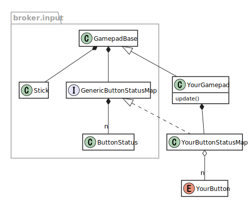

# broker

Utility library for game programming.

Mainly intended for use with [heaps](http://heaps.io/), but can also be used with any other engines (maybe).

**Requires Haxe 4** (developed with v4.0.5).

## Features

### Entity

Provides a base class for game entities, from which you can generate AoSoA classes.

See also: AoSoA generator of [banker](https://github.com/fal-works/banker) library.

### Gamepad

Abstraction of gamepad input.

Reflects any kind of physical input device (gamepad, keyboard, touch... depending on your implementation)  
and provides you an integrated virtual gamepad.

## Features to be added (maybe)

- Scene manager
- Asset manager
- Sound manager

## Caveats

Quite unstable!

## Compilation flags

|library|flag|description|
|---|---|---|
|broker|broker_generic_disable|Disables `@:generic` meta.|

## Dependencies

<!-- 
- [sneaker](https://github.com/fal-works/sneaker) (v0.7.0) for assertion, logging and macro utilities
- [ripper](https://github.com/fal-works/ripper) (v0.2.2) for partial implementation
 -->
- [banker](https://github.com/fal-works/banker) (v0.4.0) for data structures

### (Optional)

- [heaps](http://heaps.io/) (v1.7.0)
