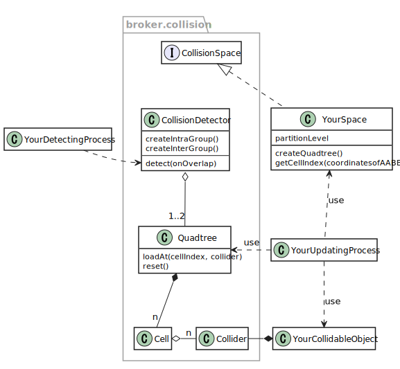
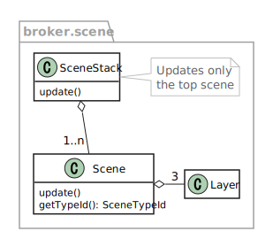
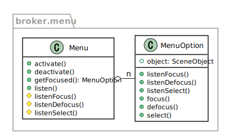

# broker

Utility library for game programming.

Currently works only with [heaps](http://heaps.io/).

**Requires Haxe 4** (developed with v4.1.1).

See also [https://github.com/fal-works/broker-sample](https://github.com/fal-works/broker-sample) for a usage example.


## Features

### Entity

Provides a base class for game entities, from which you can generate AoSoA classes.

See also: AoSoA generator of [banker](https://github.com/fal-works/banker) library.

### Collision

2D AABB collision detection.



### Gamepad

Abstraction of gamepad input.

Reflects any kind of physical input device (gamepad, keyboard, touch... depending on your implementation)  
and provides you an integrated virtual gamepad.


### Object

Elements of scene trees.

### Scene

- Basic classes for game scenes.
- Classes for managing transition between game scenes.




### Image

Classes for loading image data.

- `Tile`
- `Atlas`
- `FrameTiles`
- etc.

### Draw

Classes for drawing graphics.

- `TileDraw`
- `BatchDraw`

### Timer

Basic classes for pseudo-asynchronous processing.


### Sound

Some classes for abstracting sound features from heaps.

### Menu

Menu UI.



### Math

Some math functions/constants.

### Color

Some abstract types for representing colors.


## Caveats

Quite unstable!


## Usage

### Collision

#### Collision Space

First create your collision space by implementing `broker.collision.CollisionSpace` and providing metadata.

This adds several static fields, such as `partitionLevel` of `getCellIndex()`.

```haxe
@:broker.leftTop(0, 0) // Left-top coordinates of the entire space
@:broker.rightBottom(800, 600) // Light-bottom coordinates of the entire space
@:broker.partitionLevel(3) // Depth of quadtrees. The greater, the deeper/finer
class YourSpace implements broker.collision.CollisionSpace {}
```

The entire space will be recursively devided; the leaf (deepest/finest) level will have `pow(4, partitionLevel)` cells.

#### Collision Detector / Quadtree

Then prepare your collision detector object by either:

- `createIntraGroup()` (detects within a single collider group) or
- `createInterGroup()` (detects between two collider groups)

```haxe
final yourDetector = broker.collision.CollisionDetector.createIntraGroup(
	YourSpace.partitionLevel,
	maxNumberOfColliders
);
```

A collision detector has quadtree(s) for left/right collider groups (stored at variables `leftQuadtree`/`rightQuadtree`).

Remarks:

- Quadtrees can also be provided externally when creating a detector.
- Left and right are the same if intra-group.

#### Load colliders and detect collision

Finally,

1. Each of your collidable objects should be associated with a `Collider` instance.
2. Colliders should be loaded to your `Quadtree` before running collision detection process.  
A `Quadtree` consists of multiple `Cell`s. Use your `CollisionSpace` class for determining the cell index to load your collider.
3. After loading, use your `CollisionDetector` to run detection with any `onOverlap` callback function.
4. You should manually reset your `Quadtree` before re-loading colliders.

An example would be:

```haxe
class YourCollidableObject {
	final collider: broker.collision.Collider;

	public function new() { /* ... */ }
	public function updatePosition() { /* ... */ }

	public function loadCollider(quadtree: broker.collision.Quadtree) {
		// Get bounds (leftX, topY, rightX, bottomY) here somehow

		this.collider.setBounds(leftX, topY, rightX, bottomY);

		final cellIndex = YourSpace.getCellIndex(leftX, topY, rightX, bottomY);
		quadtree.loadAt(cellIndex, this.collider);
	}
}

class YourSystem {
	final objects: Array<YourCollidableObjects>;
	final collisionDetector: broker.collision.CollisionDetector;
	final onOverlap: (a: Collider, b: Collider) -> Void;

	public function new() { /* ... */ }

	public function run() {
		// update position of objects
		for (object in objects) object.updatePosition();

		// reset & reload quadtree
		final quadtree = collisionDetector.leftQuadtree;
		quadtree.reset();
		for (object in objects) object.loadCollider(quadtree);

		// run collision detection
		collisionDetector.detect(onOverlap);
	}
}
```


## Compilation flags

|library|flag|description|
|---|---|---|
|broker|broker_generic_disable|Disables `@:generic` meta.|


## Dependencies

- [sinker](https://github.com/fal-works/sinker) v0.4.0 or compatible
- [prayer](https://github.com/fal-works/prayer) v0.1.3 or compatible
- [sneaker](https://github.com/fal-works/sneaker) v0.10.0 or compatible
- [ripper](https://github.com/fal-works/ripper) v0.3.3 or compatible
- [banker](https://github.com/fal-works/banker) v0.6.1 or compatible

See also:
[FAL Haxe libraries](https://github.com/fal-works/fal-haxe-libraries)

### (Optional)

- [heaps](http://heaps.io/) v1.8.0 or compatible
